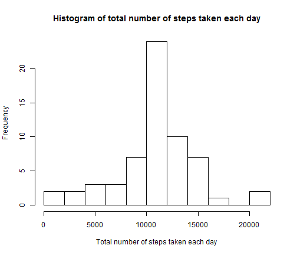

# Reproducible Research: Peer Assessment 1


## Loading and preprocessing the data

```r
library(plyr)
activity <- read.csv("activity.csv", header = TRUE)
activity[, 2] <- as.Date(activity[, 2], "%Y-%m-%d")
```


## What is mean total number of steps taken per day?

```r
agg1 <- ddply(activity, .(date), summarize, total_steps = sum(steps), mean_steps = round(mean(steps), 
    2), median_steps = median(steps))
par(bg = "white")
hist(agg1$total_steps, breaks = 10, xlab = "Total number of steps taken each day", 
    main = "Histogram of total number of steps taken each day")
```

 


Below shows the mean and median steps taken each day


```r
agg1[, c("date", "mean_steps", "median_steps")]
```

```
##          date mean_steps median_steps
## 1  2012-10-01         NA           NA
## 2  2012-10-02       0.44            0
## 3  2012-10-03      39.42            0
## 4  2012-10-04      42.07            0
## 5  2012-10-05      46.16            0
## 6  2012-10-06      53.54            0
## 7  2012-10-07      38.25            0
## 8  2012-10-08         NA           NA
## 9  2012-10-09      44.48            0
## 10 2012-10-10      34.38            0
## 11 2012-10-11      35.78            0
## 12 2012-10-12      60.35            0
## 13 2012-10-13      43.15            0
## 14 2012-10-14      52.42            0
## 15 2012-10-15      35.20            0
## 16 2012-10-16      52.38            0
## 17 2012-10-17      46.71            0
## 18 2012-10-18      34.92            0
## 19 2012-10-19      41.07            0
## 20 2012-10-20      36.09            0
## 21 2012-10-21      30.63            0
## 22 2012-10-22      46.74            0
## 23 2012-10-23      30.97            0
## 24 2012-10-24      29.01            0
## 25 2012-10-25       8.65            0
## 26 2012-10-26      23.53            0
## 27 2012-10-27      35.14            0
## 28 2012-10-28      39.78            0
## 29 2012-10-29      17.42            0
## 30 2012-10-30      34.09            0
## 31 2012-10-31      53.52            0
## 32 2012-11-01         NA           NA
## 33 2012-11-02      36.81            0
## 34 2012-11-03      36.70            0
## 35 2012-11-04         NA           NA
## 36 2012-11-05      36.25            0
## 37 2012-11-06      28.94            0
## 38 2012-11-07      44.73            0
## 39 2012-11-08      11.18            0
## 40 2012-11-09         NA           NA
## 41 2012-11-10         NA           NA
## 42 2012-11-11      43.78            0
## 43 2012-11-12      37.38            0
## 44 2012-11-13      25.47            0
## 45 2012-11-14         NA           NA
## 46 2012-11-15       0.14            0
## 47 2012-11-16      18.89            0
## 48 2012-11-17      49.79            0
## 49 2012-11-18      52.47            0
## 50 2012-11-19      30.70            0
## 51 2012-11-20      15.53            0
## 52 2012-11-21      44.40            0
## 53 2012-11-22      70.93            0
## 54 2012-11-23      73.59            0
## 55 2012-11-24      50.27            0
## 56 2012-11-25      41.09            0
## 57 2012-11-26      38.76            0
## 58 2012-11-27      47.38            0
## 59 2012-11-28      35.36            0
## 60 2012-11-29      24.47            0
## 61 2012-11-30         NA           NA
```


## What is the average daily activity pattern?

```r
agg2 <- ddply(activity, .(interval), summarize, avg_steps = round(mean(steps, 
    na.rm = TRUE), 2))
plot(agg2$interval, agg2$avg_steps, type = "l", xlab = "Interval", ylab = "Average number of steps takenacross all days")
```

 

Here is the 5-minute interval containing the maximum number of steps averaged across all the days in the dataset


```r
agg2[agg2$avg_steps == max(agg2$avg_steps), ]
```

```
##     interval avg_steps
## 104      835     206.2
```

## Imputing missing values
The total number of missing values in the dataset:

```r
length(which(is.na(activity)))
```

```
## [1] 2304
```


The strategy for imputing missing data is to replace with average number of steps for the interval across all days


```r
activity2 <- activity
for (i in 1:nrow(activity2)) {
    if (is.na(activity2[i, "steps"])) {
        activity2[i, "steps"] <- agg2[agg2$interval == activity2[i, "interval"], 
            "avg_steps"]
    }
}
agg3 <- ddply(activity2, .(date), summarize, total_steps = sum(steps), mean_steps = round(mean(steps), 
    2), median_steps = median(steps))
par(bg = "White")
hist(agg3$total_steps, breaks = 10, xlab = "Total number of steps taken each day", 
    main = "Histogram of total number of steps taken each day")
```

 

```r
agg3[, c("date", "mean_steps", "median_steps")]
```

```
##          date mean_steps median_steps
## 1  2012-10-01      37.38        34.12
## 2  2012-10-02       0.44         0.00
## 3  2012-10-03      39.42         0.00
## 4  2012-10-04      42.07         0.00
## 5  2012-10-05      46.16         0.00
## 6  2012-10-06      53.54         0.00
## 7  2012-10-07      38.25         0.00
## 8  2012-10-08      37.38        34.12
## 9  2012-10-09      44.48         0.00
## 10 2012-10-10      34.38         0.00
## 11 2012-10-11      35.78         0.00
## 12 2012-10-12      60.35         0.00
## 13 2012-10-13      43.15         0.00
## 14 2012-10-14      52.42         0.00
## 15 2012-10-15      35.20         0.00
## 16 2012-10-16      52.38         0.00
## 17 2012-10-17      46.71         0.00
## 18 2012-10-18      34.92         0.00
## 19 2012-10-19      41.07         0.00
## 20 2012-10-20      36.09         0.00
## 21 2012-10-21      30.63         0.00
## 22 2012-10-22      46.74         0.00
## 23 2012-10-23      30.97         0.00
## 24 2012-10-24      29.01         0.00
## 25 2012-10-25       8.65         0.00
## 26 2012-10-26      23.53         0.00
## 27 2012-10-27      35.14         0.00
## 28 2012-10-28      39.78         0.00
## 29 2012-10-29      17.42         0.00
## 30 2012-10-30      34.09         0.00
## 31 2012-10-31      53.52         0.00
## 32 2012-11-01      37.38        34.12
## 33 2012-11-02      36.81         0.00
## 34 2012-11-03      36.70         0.00
## 35 2012-11-04      37.38        34.12
## 36 2012-11-05      36.25         0.00
## 37 2012-11-06      28.94         0.00
## 38 2012-11-07      44.73         0.00
## 39 2012-11-08      11.18         0.00
## 40 2012-11-09      37.38        34.12
## 41 2012-11-10      37.38        34.12
## 42 2012-11-11      43.78         0.00
## 43 2012-11-12      37.38         0.00
## 44 2012-11-13      25.47         0.00
## 45 2012-11-14      37.38        34.12
## 46 2012-11-15       0.14         0.00
## 47 2012-11-16      18.89         0.00
## 48 2012-11-17      49.79         0.00
## 49 2012-11-18      52.47         0.00
## 50 2012-11-19      30.70         0.00
## 51 2012-11-20      15.53         0.00
## 52 2012-11-21      44.40         0.00
## 53 2012-11-22      70.93         0.00
## 54 2012-11-23      73.59         0.00
## 55 2012-11-24      50.27         0.00
## 56 2012-11-25      41.09         0.00
## 57 2012-11-26      38.76         0.00
## 58 2012-11-27      47.38         0.00
## 59 2012-11-28      35.36         0.00
## 60 2012-11-29      24.47         0.00
## 61 2012-11-30      37.38        34.12
```


## Are there differences in activity patterns between weekdays and weekends?

```r
activity2$day_flag <- sapply(activity2$date, function(x) {
    if ((weekdays(x) == "Sunday") | (weekdays(x) == "Saturday")) {
        "weekend"
    } else {
        "weekday"
    }
})
agg4 <- ddply(activity2, .(interval, day_flag), summarize, avg_steps = round(mean(steps, 
    na.rm = TRUE), 2))
agg4 <- transform(agg4, day_flag = factor(day_flag))
library(lattice)
xyplot(avg_steps ~ interval | day_flag, type = "l", data = agg4, ylab = "Number of steps", 
    xlab = "Interval", layout = c(1, 2))
```

 

